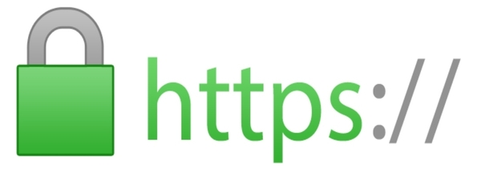

import Tabs from "@theme/Tabs";
import TabItem from "@theme/TabItem";

# HTTPS (SSL)

:::caution
If you are not using a domain, you will not be able to use SSL.

<Link to="../hosting" className="button button--warning button--lg">
  Continue with installation
</Link>
:::

```
* Do you want to automatically configure HTTPS using Let's Encrypt? (y/N):
```

SSL is that little green lock icon that you see on the top left of your browser, when visiting a secure website.



It is what tells that the website is using an encrypted connection.  
If you want to use SSL for your panel, you will need to create a certificate for your domain.

There are 2 ways in the script to set up SSL:

- Using Let's Encrypt
- Using your own certificates

<Tabs>
  <TabItem value="lets_encrypt" label="Let's encrypt" default>
    <p>
      It's easy to set up SSL using Let's Encrypt. The script will automatically
      try to create a certificate for your domain.
    </p>
  </TabItem>
  <TabItem value="ssl_certs" label="SSL certificates">
    <p>
      This way certificates are created manually by the user. After installation
      for a working panel you will need to place certificates in the following
      locations: - Public certificate:
      <code>/etc/letsencrypt/live/domain/fullchain.pem</code>
    </p>
  </TabItem>
</Tabs>
