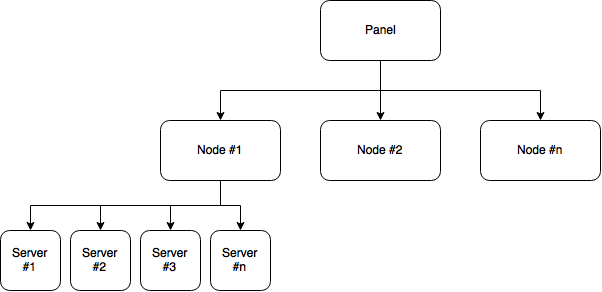

# Terminology

**Panel** — This refers to Pterodactyl Panel itself, and is what allows you to add additional
nodes and servers to the system.

**Node** — A node is a physical machine that runs an instance of Wings.

**Wings** — A service which interfaces with Docker and the Panel to provide secure access for
controlling servers via the Panel.

**Server** — In this case, a server refers to a running instance that is created by the panel. These servers are
created on nodes, and you can have multiple servers per node.

## Example Setup Diagram

